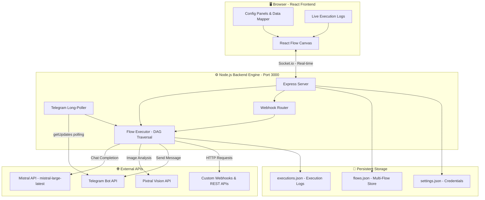

# Le Flux: The Native Mistral Agent Builder

*Because Mistral deserves its own native agent builder to leverage its full suite and capabilities.*

**Le Flux** brings the elegance and simplicity of Mistral's "La Plateforme" into an interactive, visual Node-based orchestration canvas. It empowers developers to build, orchestrate, and deploy complex AI workflows and multi-agent systems using native Mistral models—all running on a powerful, locally-hostable headless backend engine.

---

## 🏆 Built for the Mistral Worldwide Hackathon 2026 (Online Edition)

This project was built during the **2026 Mistral Worldwide Hackathon** to provide the Mistral ecosystem with a first-class, open-source workflow orchestration tool.

🔗 **Hackathon Links:**
- [Mistral Worldwide Hackathon – Official Site](https://worldwide-hackathon.mistral.ai/)
- [Hackathon on Luma (Online Edition)](https://luma.com/mistralhack-online?tk=cGkSSb)
- [Hackathon on Iterate](https://hackiterate.com/mistral-worldwide-hackathons)

**Sponsors & Partners:**

> **AWS** · **Hugging Face** · **NVIDIA** · **Weights & Biases** · **Mistral** · **ElevenLabs** · **Giant** · **Raise** · **Tilde Research** · **White Circle** · **Jump Trading**

---

## 🚀 The Vision & The Problem

Top AI companies offer powerful ecosystem tools, but developers building with Mistral lacked a specialized, native visual builder that integrated seamlessly with Mistral's specific models (like Pixtral) while maintaining a clean, professional "La Plateforme" aesthetic. 

**The Problem:** Building multi-agent workflows involves hardcoding API chains, managing asynchronous event triggers, and dealing with opaque execution states, making iterations slow.
**The Solution:** Le Flux. A robust open-source React Flow + Node.js platform offering visual drag-and-drop construction, isolated execution engines, live websocket logging, and deep Mistral integration.

---

## 🏗️ Architecture & Core Features

Le Flux isn't just a frontend—it is powered by a custom-built backend execution engine explicitly designed for event-driven agent workflows.



### 1. Multi-Flow Headless Engine
- **Independent Execution Contexts:** The backend Express/Node.js server runs multiple flows simultaneously. Each flow execution creates a sandboxed context and logs its run with a unique `flowId`.
- **Background Event Polling:** The server natively handles background polling and listening. When a trigger event occurs, it automatically traverses the DAG (Directed Acyclic Graph) of the relevant flow.

### 2. Native System Triggers
- **Webhooks:** Expose endpoints `POST /api/webhook/:id` directly from the UI to trigger intelligent routing flows.
- **Telegram Native Integration:** Built-in Telegram Long-Polling. Users can drop a "Telegram Trigger" node and Le Flux's backend will automatically start polling for messages sent to their registered bot contextually isolating commands to specific workflows.

### 3. Deep Mistral Integration
- **Mistral LLM Node:** Dynamic integration with `mistral-large-latest` for logical reasoning, extraction, and natural language tasks, fully configurable via the UI (System Prompts, custom variables).
- **Pixtral API Node:** Vision capabilities integrated natively to pass and evaluate image URLs seamlessly through the flow.

### 4. Live Developer Experience (DX)
- **Websocket Real-Time Logging:** Execution traces, latency metrics, token consumption, and node outputs are streamed directly back to the visual canvas via Socket.io.
- **Data Mapping Engine:** A powerful "Data Mapper" node using Mustache templating allows developers to dynamically inject JSON payloads from upstream nodes into downstream prompts `(e.g., {{ node_xyz.data.message.text }})`.

---

## 🔮 Future Roadmap: Building Together

Le Flux was designed from day one with a **modular, extensible architecture**. Every node type is a self-contained unit, making it straightforward for the community to contribute new integrations. Here's where we're headed:

### Phase 1 — Core Stability *(Current)*
- [x] Multi-flow management with independent execution contexts
- [x] Native Webhook & Telegram triggers with background polling
- [x] Mistral LLM & Pixtral vision nodes
- [x] Real-time websocket execution logs & data mapping engine

### Phase 2 — Richer Node Ecosystem
- [ ] **Voice & Audio Nodes** — Text-to-Speech and Speech-to-Text integration (ElevenLabs, Whisper) to build conversational voice agents directly on the canvas
- [ ] **Database Connector Nodes** — Read/write from PostgreSQL, Supabase, MongoDB, or Firebase to persist and query data mid-flow
- [ ] **Conditional Logic & Branching** — If/Else nodes, Switch nodes, and loop constructs to enable complex decision trees without code

### Phase 3 — Observability & DevOps
- [ ] **Execution Analytics Dashboard** — Aggregated metrics per flow: average latency, token consumption trends, error rates
- [ ] **MLOps Logging** — Structured trace export compatible with Weights & Biases, LangSmith, or custom observability pipelines
- [ ] **Version Control for Flows** — Git-like versioning of flow configurations to track changes, rollback, and collaborate

### Phase 4 — Community & Deployment
- [ ] **Node Marketplace** — A community-driven registry where developers can publish, share, and install custom nodes as plugins
- [ ] **One-Click Cloud Deploy** — Deploy flows as serverless endpoints (AWS Lambda, Cloudflare Workers, or Dokploy) directly from the UI
- [ ] **Multi-User Collaboration** — Real-time collaborative editing of flows with role-based access control
- [ ] **Mistral Fine-Tuning Integration** — Trigger fine-tuning jobs from within a flow using collected conversation data

> 🤝 **This is an open-source project.** We believe the best tools are built by the community, for the community. Contributions, ideas, and feedback are always welcome—whether it's a new node type, a UI improvement, or a bug fix. Let's build this together.

---

## 🛠️ Local Setup & Deployment

### Prerequisites
- Node.js v20+
- A Mistral API Key (`MISTRAL_API_KEY`)
- *(Optional)* A Telegram Bot Token (`TELEGRAM_BOT_TOKEN`)

### Installation

1. Clone the repository and install dependencies:
```bash
git clone https://github.com/cedioza/Le-Flux.git
cd Le-Flux
npm install
```

2. Create a `.env` file in the root directory:
```env
MISTRAL_API_KEY=your_mistral_api_key_here
TELEGRAM_BOT_TOKEN=your_telegram_bot_token_here
```

3. Start the Platform (this will concurrently start the backend engine and the Vite frontend):
```bash
npm run dev
```

4. Open `http://localhost:5173` in your browser. The backend engine runs locally on port `3000`.

---
*Built with ❤️ during the Mistral Hackathon.*
